# EAGLE CUSTOM LIBRARY

## LIST LIBRARY
Name | Description | Footprint | USAGE | 3D
---- | ----------- | ------- | ------- | -------
TVRB4824LD-50WR3_TDPOWER | ISOLATED PSU for Output 24VDC at a cheap price from manufacture TDPOWER |  |   | 
NANOPI DUO2 | MINI PC WITH SMALL DIMENSION CAN RUNNING UBUNTU | 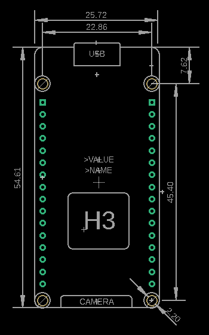 | 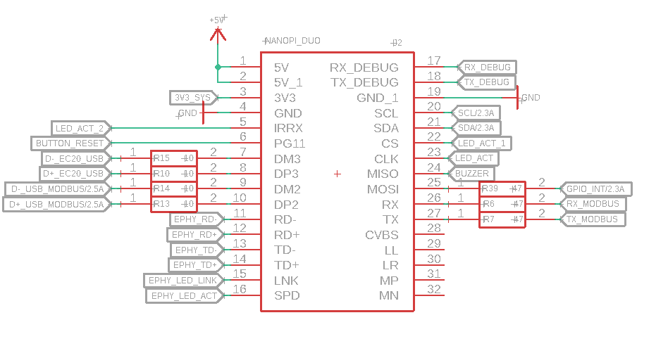  | 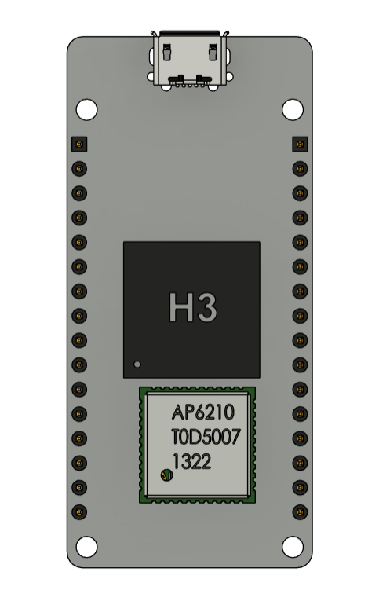
TJ-L3F2LTQYKMQFLC7K-A5 | DUAL LED WITH BOX | 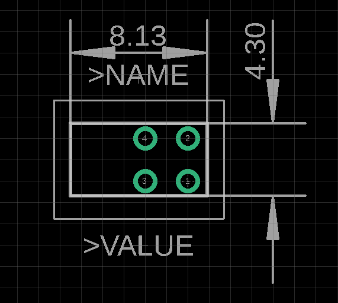 | 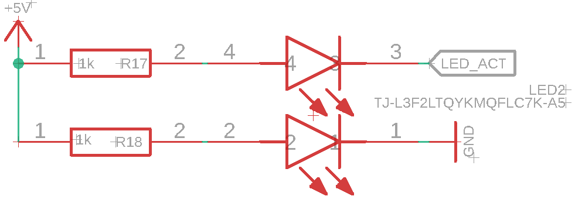  | 
STM32F4-MODUL-WEACT| STM32F4 MODULE FROM WEACT | 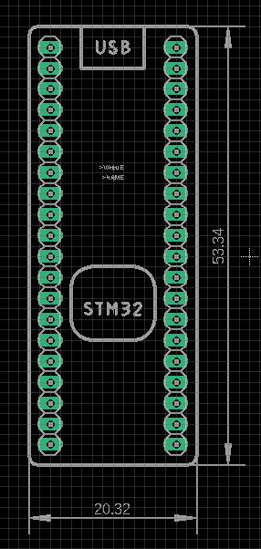 |   | 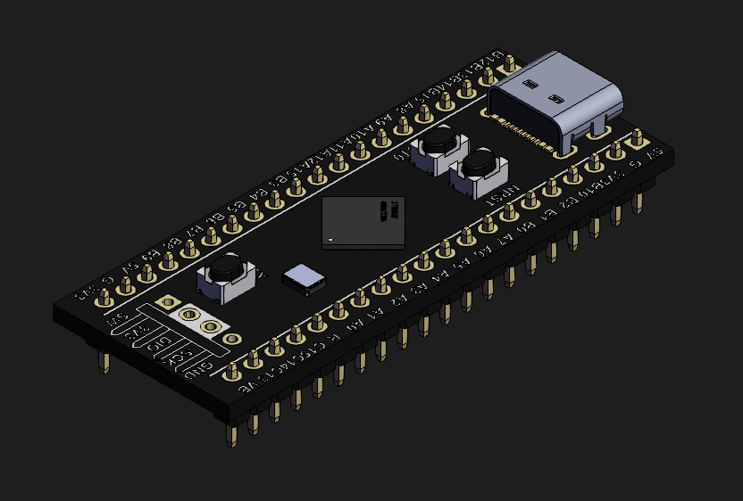
NANOPI-NEO-PLUS2| MINI PC WITH SMALL DIMENSION CAN RUNNING UBUNTU | 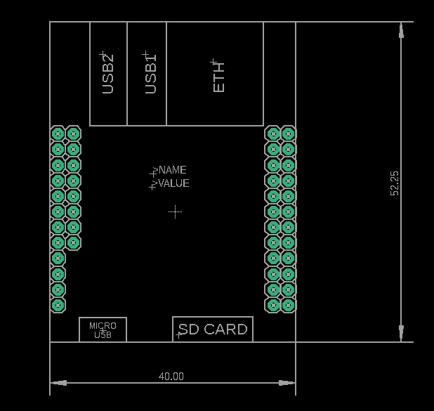 | 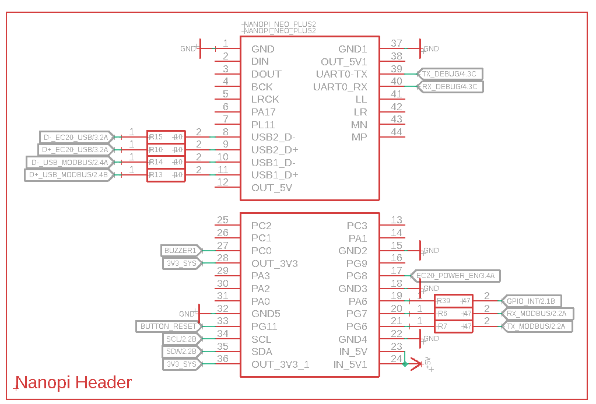  | 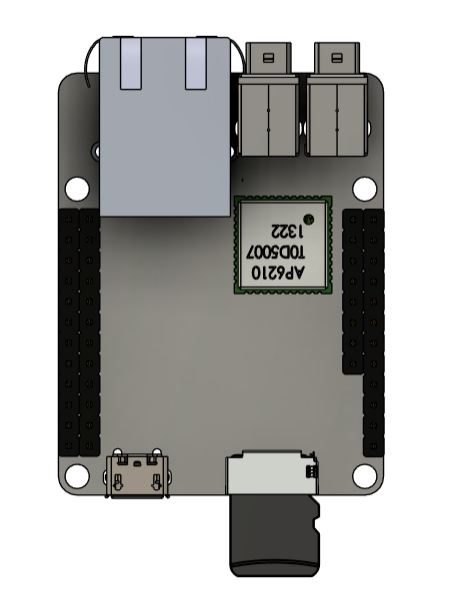
DECAWAVE DWM1004| RF MODULES DW1000 BASED MODULE | 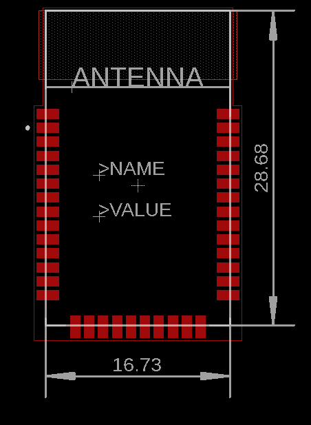 | 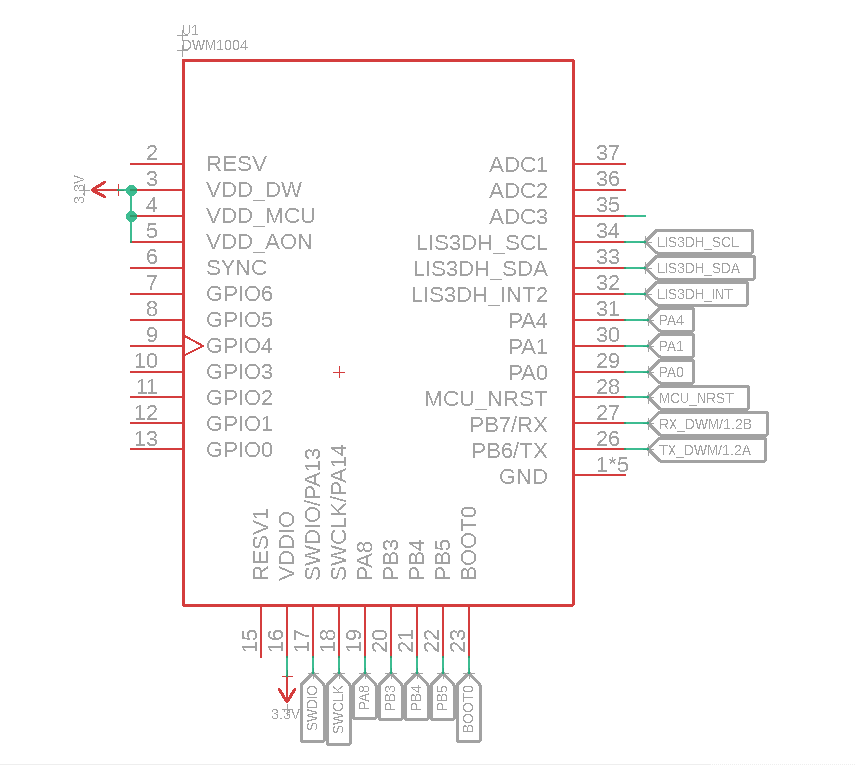  | 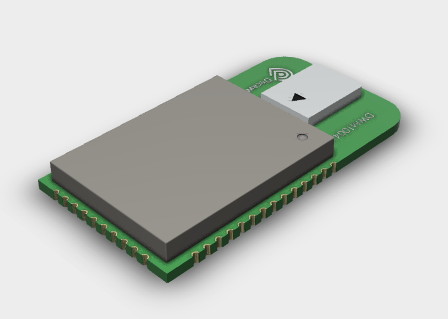
PTV09A 4030U B204| POTENTIOMETER WITH VERTICAL USAGE | 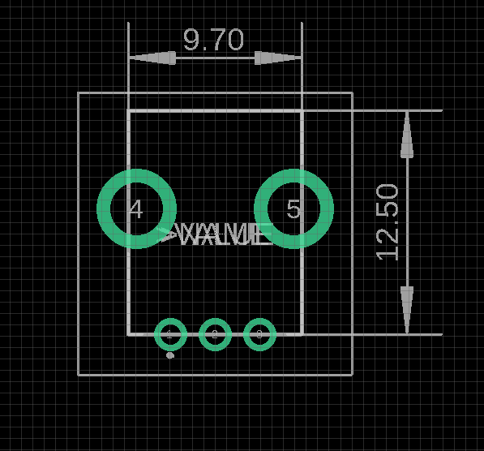 | 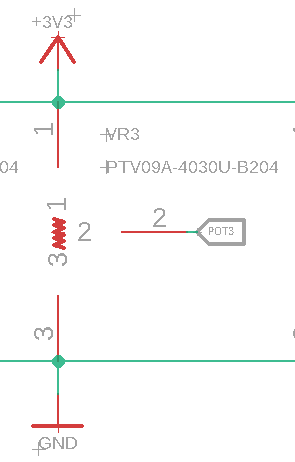  | 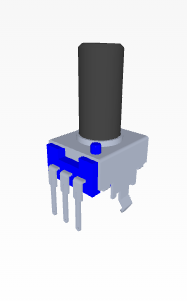